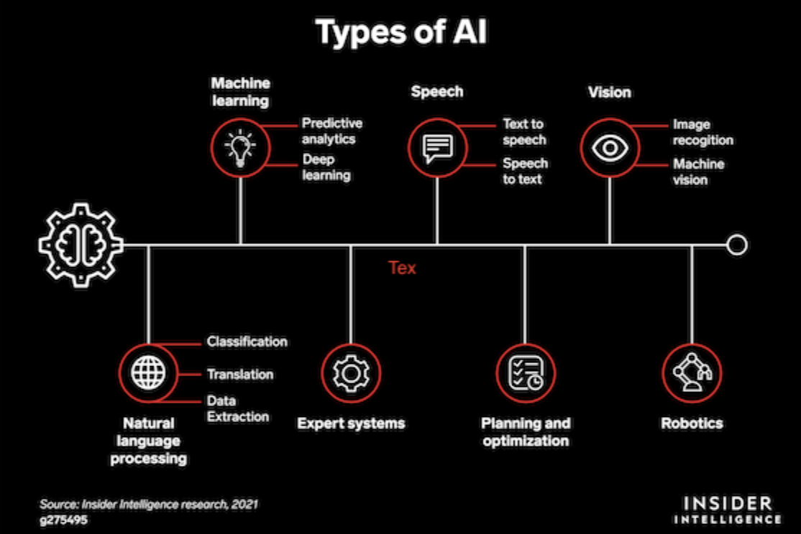

# Intro

## AI: Artificial Intelligence

## ML: Machine Learning

- [ ]
- [ ][MIT: MATHEMATICS OF MACHINE LEARNING](https://ocw.mit.edu/courses/18-657-mathematics-of-machine-learning-fall-2015/)

Machines and humans learn in entirely different ways, which is why the first part of this book is essential to your understanding of machine learning. Machines perform routine tasks at incredible speeds, but still require humans to do the actual thinking. The second part of this book is about getting your system set up to use the various Python coding examples. The two setups work for desktop systems using Windows, Mac OS, or Linux, or mobile devices that have access to a Google Colab compatible browser. If you’re using R, you’ll find a README file in the R download file that contains instructions for configuring your R Anaconda environment.

The third part of the book discusses math basics with regard to machine learning requirements. It prepares you to perform math tasks associated with algorithms used in machine learning to make either predictions or classifications from your data. The fourth part of the book helps you discover what to do about data that isn’t quite up to par. This part is also where you start learning about similarity and working with linear models. The most advanced chapter tells you how to work with ensembles of learners to perform tasks that might not otherwise be reasonable to complete.

The fifth part of the book is about practical application of machine learning techniques. You see how to do things like classify images, work with opinions and sentiments, and recommend products and movies. The last part of the book contains helpful information to enhance your machine learning experience. This part of the book also contains a chapter specifically oriented toward ethical data use.

### Apply Machine Learning
* Ads, learning behavior of consumers
* News feeds, learning what's relevant to social media users
* Shopping, learning behavior of customers
* Customized experience

### Business Problems and Data Science Solutions

- **Classification and class probability estimation attempt** to predict, for each individual in a population, which of a (small) set of classes this individual belongs to. Usually the classes are mutually exclusive. An example classification question would be: “Among all the customers of MegaTelCo, which are likely to respond to a given offer?” In this example the two classes could be called will respond and will not respond.

- **Regression (“value estimation”) attempts to estimate or predict**, for each individual, the numerical value of some variable for that individual. An example regression question would be: “How much will a given customer use the service?” The property (variable) to be predicted here is service usage, and a model could be generated by looking at other, similar individuals in the population and their historical usage. A regression procedure produces a model that, given an individual, estimates the value of the particular variable specific to that individual.

- **Clustering attempts** to group individuals in a population together by their similarity, but not driven by any specific purpose. An example clustering question would be: “Do our customers form natural groups or segments?” Clustering is useful in preliminary domain exploration to see which natural groups exist because these groups in turn may suggest other data mining tasks or approaches.

- **Co-occurrence grouping (also known as frequent itemset mining, association rule discovery, and market-basket analysis) attempts** to find associations between entities based on transactions involving them. Deciding how to act upon this discovery might require some creativity, but it could suggest a special promotion, product display, or combination offer. Co-occurrence of products in purchases is a common type of grouping known as market-basket analysis. Some recommendation systems also perform a type of affinity grouping by finding, for example, pairs of books that are purchased frequently by the same people (“people who bought X also bought Y”). The result of co-occurrence grouping is a description of items that occur together. These descriptions usually include statistics on the frequency of the co-occurrence and an estimate of how surprising it is.

- **Profiling (also known as behavior description) attempts** to characterize the typical behavior of an individual, group, or population.

- **Link prediction attempts** to predict connections between data items, usually by suggesting that a link should exist, and possibly also estimating the strength of the link.

- **Data reduction attempts** to take a large set of data and replace it with a smaller set of data that contains much of the important information in the larger set. The smaller dataset may be easier to deal with or to process. Moreover, the smaller dataset may better reveal the information.

- **Causal modeling attempts** to help us understand what events or actions actually influence others.

**Classification, regression, and causal modeling generally are solved with supervised methods. Similarity matching, link prediction, and data reduction could be either. Clustering, co-occurrence grouping, and profiling generally are unsupervised**

Common questions

1. “Will this customer purchase service S1 if given incentive I?” This is a classification problem because it has a binary target (the customer either purchases or does not).
2. “Which service package (S1, S2, or none) will a customer likely purchase if given incentive I?” This is also a classification problem, with a three-valued target.
3. “How much will this customer use the service?” This is a regression problem because it has a numeric target. The target variable is the amount of usage (actual or predicted) per customer.

### What is Machine Learning?

| Technique           |  Machine Learning  |  Statistics  |
|---------------------|:---------:|:-----------:|
| Data handling  |  Works with big data in the form of networks and graphs. Raw data from sensors or the web text is split into training and test data. | Models are used to create predictive power on small samples. |
| Data input | The data is sampled, randomized, and transformed to maximize accuracy scoring in the prediction of out-of-sample (or completely new) examples. | Parameters interpret real-world phenomena and provide a stress on magnitude. |
| Result | Probability is taken into account for comparing what could be the best guess or decision. | The output captures the variability and uncertainity of parameters. | 
| Assumptions | The scientist learns from the data. | The scientist assumes a certain output and tries to prove it. |
| Distribution | The distribution is unknown or ignored before learning from data.  | The scientist assumes a well-defined distribution. | 
| Fitting | The scientist creates a best fit, but generalized, model. | The result is fit to the present data distribution. | 

**What it means to learn**
* In ML, you don't create explicit rules
* Problem → Create rule → Apply rule → Feedback → Adjust rule

### Tribes

The five tribes are – 

- **Symbolists**: The origin of this tribe is in logic and philosophy. This group relies on inverse deduction to solve problems. Symbolic reasoning The term inverse deduction commonly appears as induction. In symbolic reasoning, deduction expands the realm of human knowledge, while induction raises the level of human knowledge. Induction commonly opens new fields of exploration, while deduction explores those fields. However, the most important consideration is that induction is the science portion of this type of reasoning, while deduction is the engineering. The two strategies work hand in hand to solve problems by first opening a field of potential exploration to solve the problem and then exploring that field to determine whether it does, in fact, solve it.

- **Connectionists**: The origin of this tribe is in neuroscience. This group relies on backpropagation to solve problems. As an example of this strategy, deduction would say that if a tree is green and green trees are alive, the tree must be alive. When thinking about induction, you would say that the tree is green and the tree is also alive; therefore, green trees are alive. Induction provides… Connections modelled on the brain’s neurons The connectionists are perhaps the most famous of the five tribes. This tribe strives to reproduce the brain’s functions using silicon instead of neurons. Essentially, each of the neurons (created as an algorithm that models the real-world counterpart) solves a small piece of… The use of backpropagation, or backward propagation of errors, seeks to determine the conditions under which errors are removed from networks built to resemble the human neurons by changing the weights (how much a particular input figures into the result) and biases (which features are selected) of the network. The goal is to continue changing the weights and biases until such time as the actual output matches the target output. At this point, the artificial neuron fires and passes its solution along to the next neuron in line. The solution created by just one neuron…

- **Evolutionaries**: The origin of this tribe is in evolutionary biology. This group relies on genetic programming to solve problems. Evolutionary algorithms that test variation The evolutionaries rely on the principles of evolution to solve problems. In other words, this strategy is based on the survival of the fittest (removing any solutions that don’t match the desired output). A fitness… Using a tree structure, the solution method looks for the best solution based on function output. The winner of each level of evolution gets to build the next-level functions. The idea is that the next level will get closer to solving the problem but may not solve it completely, which means that another level is needed. This particular tribe relies heavily on recursion and languages that strongly support recursion to solve problems. An interesting output…

- **Bayesians**: The origin of this tribe is in statistics. This group relies on probabilistic inference to solve problems. Bayesian inference The Bayesians use various statistical methods to solve problems. Given that statistical methods can create more than one apparently correct solution, the choice of a function becomes one of determining which function has the highest probability of succeeding. For example, when using these techniques, you can accept a set of symptoms as input and decide the probability that a particular disease will result from the symptoms as output. Given that multiple diseases have the same symptoms, the probability… Ultimately, this tribe supports the idea of never quite trusting any hypothesis (a result that someone has given you) completely without seeing the evidence used to make it (the input the other person used to make the hypothesis). Analyzing the evidence proves or disproves the hypothesis that it supports. Consequently, it isn’t possible to determine which disease someone has until…

- **Analogizers**: The origin of this tribe is in psychology. This group relies on kernel machines to solve problems. Systems that learn by analogy The analogyzers use kernel machines to recognize patterns in data. By recognizing the pattern of one set of inputs and comparing it to the pattern of a known output, you can create a problem solution. The goal is to use similarity to determine the best solution to a problem. It’s the kind of reasoning that… therefore, using that solution for a similar set of circumstances should also work. One of the most recognizable outputs from this tribe is recommender systems. For example, when you get on Amazon and buy a product, the recommender system comes...

## Deep Learning

- [ ] [MIT: Introduction to Deep Learning](https://ocw.mit.edu/courses/6-s191-introduction-to-deep-learning-january-iap-2020/)
- https://www.youtube.com/playlist?list=PLZHQObOWTQDNU6R1_67000Dx_ZCJB-3pi
    - But what is a neural network? | Chapter 1, Deep learning
    - Gradient descent, how neural networks learn | Chapter 2, Deep learning
    - What is backpropagation really doing? | Chapter 3, Deep learning
    - Backpropagation calculus | Chapter 4, Deep learning
