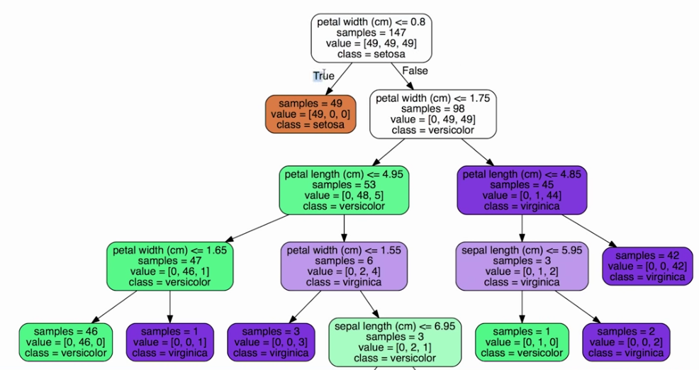

# Machine Learning

## Introduction

Machines perform routine tasks at incredible speeds, but still require humans to do the actual thinking.

Themes:
- Regression
- Loss
- Generalization
- Representation
- Regularization
- Logistic Regression
- Classification
- Introduction to Neural Networks
- Multi-Class Neural Networks
- Embeddings
- Production Machine Learning Systems
- Machine Learning Fairness and Remediating Bias
- Testing and Debugging Models


## Steps

*Problem → Create rule → Apply rule → Feedback → Adjust rule*

In ML, you don't create explicit rules. ML prepares you to perform math tasks associated with algorithms used in machine learning to make either predictions or classifications from your data. 


## Different types of Machine Learning

### Supervised learning

Tutor show how to work and machine will replicate
**You know a lot more about the data.**

Pros
Needs a knowledgeable tutor

- Labeled sample data: tagged with identifiable information
- Inputs: dependable variables
- Output: independable variables

Difference Between Independent and Dependent Variables in Machine Learning
Independent variables (also referred to as Features) are the input for a process that is being analyzes. Dependent variables are the output of the process.

#### Steps
1) Collect Training Data
2) Train Classifier
3) Make Predictions

This code represents the ML to tell the difference between Apples and Oranges. 

Training Data
| Weight | Texture | Label  |
|--------|---------|--------|
| 150g   | Bumpy   | Orange |
| 170g   | Bumpy   | Orange |
| 140g   | Smooth  | Apple  |
| 130g   | Smooth  | Apple  |

```
from sklearn import tree

# 0 is for Bumpy, 1 is for Smooth
features = [[140, 1], [130, 1], [150, 0], [170, 0]]

# 0 is for Apple, 1 is for Oranges
labels = [0, 0, 1, 1]

clf = tree.DecisionTreeClassifier()
clf = clf.fit(features, labels)

# Trying to predict if a 150g, Bumpy fruit if an Apple or an Orange 
print clf.predict([[150, 0]])
```

#### Analyzing the Results




### Unsupervised learning 

Machine will find patterns and learn.
**You don't know about the data. Machine will create the clusters. Because of that, Unsupervised needs a massive amount of data.**

Pros
- Needs to watch a lot of data
- Needs to watch good data

Learning and improving by trial and error: unlabeled data
Use different algorithms to study and learn about the data

Output
- Multiclass Classification: several groups you want to classify your data


### Semi-supervised learning

Combination of both
Cross over about both types of data

Steps
- Supervised: Start a training set in order for machine to learn
- Unsupervised: Fit the machine to classify the rest (inductive reasoning)

Inductive and transductive reasoning leads to misleading data. 
- Transduction is reasoning from observed, specific (training) cases to specific (test) cases. In contrast, induction is reasoning from observed training cases to general rules, which are then applied to the test cases.

Reinforcement
Reinforcement learning lets the machine learn with inputs from the user towards the best strategy.

### Q learning
States = set environment
Actions = responses
Quality = Q


## What makes a good feature?

- Need different kinds of information. Exercise is to brainstorm the features that make them distinct. 

To avoid:
- If the feature distribution is ~50%/~50, it's useless. That will make the model confused.
- Remove redundant information. Height in cm and height in mi are related, so they'll be redundant to the model


## Resources
- [X] [Neural Networks](https://www.youtube.com/playlist?list=PLOU2XLYxmsIIuiBfYad6rFYQU_jL2ryal)
- [X] [Google Developers: Hello World - Machine Learning Recipes #1](https://www.youtube.com/watch?v=cKxRvEZd3Mw)
- [X] [Data School: What is machine learning, and how does it work?](https://www.youtube.com/watch?v=elojMnjn4kk)
- [ ] [MIT: MATHEMATICS OF MACHINE LEARNING](https://ocw.mit.edu/courses/18-657-mathematics-of-machine-learning-fall-2015/)
- [ ] [Linkeding Learning: Python for Data Science Essential Training Part 2](https://www.linkedin.com/learning/python-for-data-science-essential-training-part-2?u=56685617)